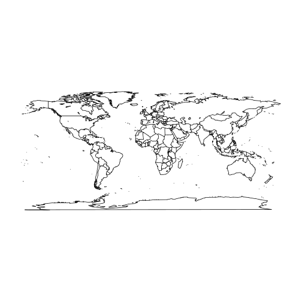
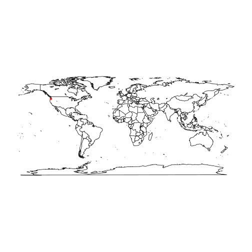
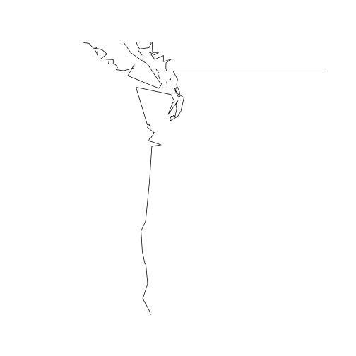
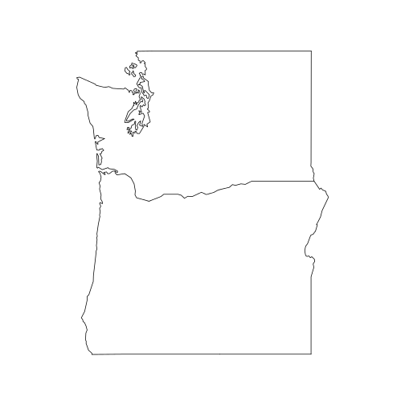
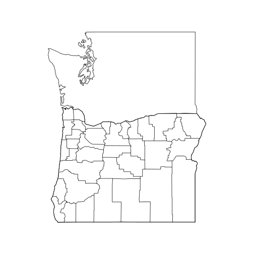
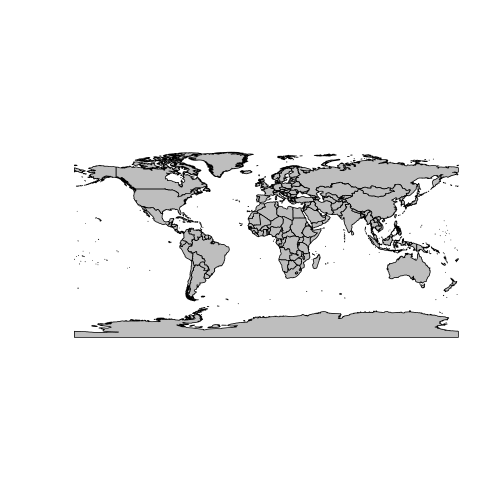
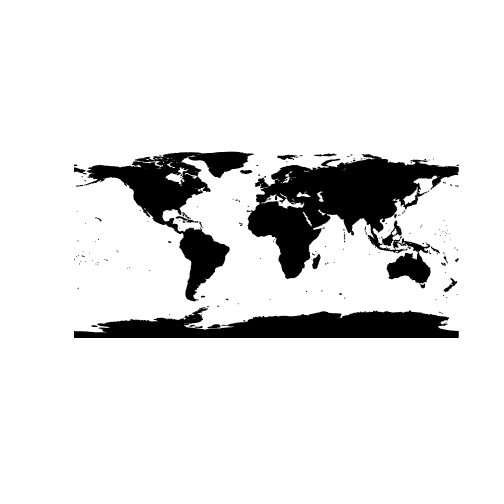
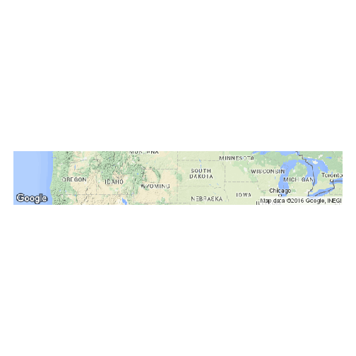

Module13pres
========================================================
author: Brian Steves
date: May 6, 2016

Simple maps with the "maps" package
========================================================


```r
library(maps)
map("world")  
```



Add a point
======================================================
 

```r
# add a point (roughly portland)
pdx_lat <- 45.52
pdx_lon <- -122.68
map("world")
points(pdx_lon, pdx_lat, col="red", pch=20, cex=1)
```
***


Zoom to specific area
====================================================

```r
map("world", xlim=c(-130,-115), ylim=c(40,50))
```


***

```r
# map by state
map("state", region=c("Washington", "Oregon"))
```




Now let's add the counties to Oregon
===================================================

```r
map("state", region=c("Washington","Oregon"))
map("county", "Oregon", add=T)
```




Plotting Shapefiles with Maptools
========================================================


```r
library(maptools)
countries <- readShapePoly("~/Geoprocessing_Shapefiles/Countries.shp")
plot(countries, col="gray")
```


Plotting a shapefile using the "rgdal" package
=====================================================

```r
library(rgdal)
dsn<-path.expand("~/Geoprocessing_Shapefiles")
countries2 <- readOGR(dsn,"Countries")
plot(countries2, col="black")
```

==================================================


```
OGR data source with driver: ESRI Shapefile 
Source: "/home/stevesb/Geoprocessing_Shapefiles", layer: "Countries"
with 250 features
It has 8 fields
```



Plotting Goolge Maps
===================================================

```r
library(dismo)
OR_map <- gmap("Oregon", size=c(600, 600))
plot(OR_map)
```




