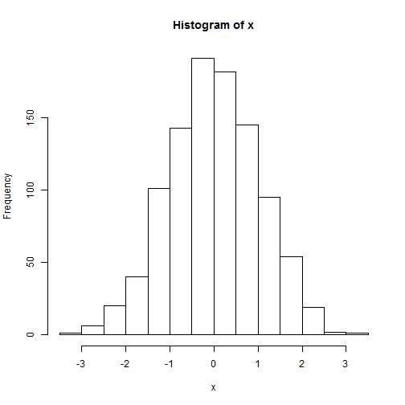
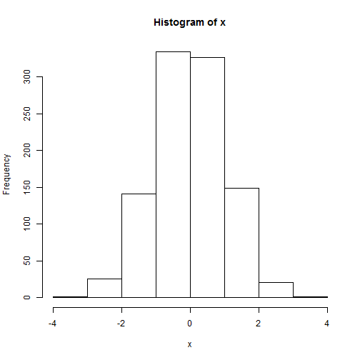
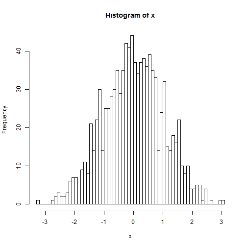
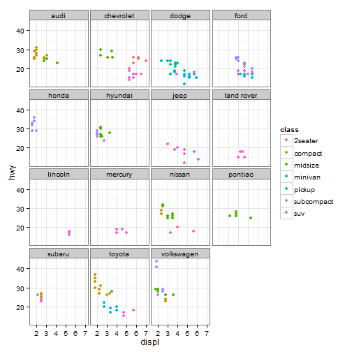

ESM 505/ESR 605 : Data Management, Spring 2014

Module 9: Creating Plots
====================


## Creating Plots

### Base Plot Functions

#### plot()
The plot() function is a generic function for plotting objects in R. The most basic form of plot() is plotting coordinates X and Y.  


```r
# basic x,y plot
xdat <- seq(1, 10, by = 0.1)
ydat <- sin(xdat)

# using x,y
plot(xdat, ydat)
```

 

```r

# using y~x formula
plot(ydat ~ xdat)
```

 


#### lines()
You can add a line connecting points on a plot using lines().  

```r
plot(xdat, ydat)
lines(xdat, ydat)
```

 


#### barplot()
Barplot() plots a bar plot.


```r
# loading some builtin data
print(VADeaths)
```

```
##       Rural Male Rural Female Urban Male Urban Female
## 50-54       11.7          8.7       15.4          8.4
## 55-59       18.1         11.7       24.3         13.6
## 60-64       26.9         20.3       37.0         19.3
## 65-69       41.0         30.9       54.6         35.1
## 70-74       66.0         54.3       71.1         50.0
```

```r
barplot(VADeaths)
```

 

```r
barplot(VADeaths, beside = TRUE)
```

 


#### hist()
To plot histograms you can use the hist() function.


```r
# 1000 normally random points with a mean of 0 and a SD of 1
x <- rnorm(1000)
hist(x)
```

 


You can specify the number of breaks.

```r
hist(x, breaks = 5)
```

 

```r
hist(x, breaks = 50)
```

 


### plot() with specific R objects
Sometimes using plot() with an object generated by specific functions will create very specific type of plot.

For example, plotting the outpu of a hierarchical clustering (hclust).


```r
hc <- hclust(dist(USArrests), "ave")
plot(hc)
```

 


### Refining plots with par
If you want to tweak basic plot functions you need to familarize your self with par (i.e. graphic parameters).  These graphical parameters can be set within the plot function or afterwards with the par() function.  (see ?par for more information).  

Some basic plotting parameters..

pch = an integer specifying the symbol to be used in plotting.  For example, 1 is an open circle, 3 is a plus, 16 is a filled circle, etc.. (see ?points) for more details.  

col = to specify a color

cex = specify the magnification of symbol (and other features) size.


```r
# plot x vs y again in red, filled circles, twice normal size
plot(xdat, ydat, col = "red", pch = 16, cex = 2)
```

 


### Titles and axis labels


```r
plot(xdat, ydat, main = "Sine curve", xlab = "X Values", ylab = "Y Values")
```

 


### ggplot2 package
The ggplot2 package introduces an entirely different way to plot using the "grammar of graphics".  The general principle is that plots (graphics) are created with a series of building blocks each consisting of data, mapping of aesthetics, geometric objects, and potentially a statistical transformation.   

For detailed documentation see the following site...
http://docs.ggplot2.org/current/

Here's a simple example..

```r
library(ggplot2)
dat <- data.frame(xdat, ydat)
p <- ggplot(dat, aes(x = xdat, y = ydat))
p <- p + geom_line()
print(p)
```

 


Here's a more complicated example that based on more complicated data.


```r
# some built in data about diamonds
head(diamonds)
```

```
##   carat       cut color clarity depth table price    x    y    z
## 1  0.23     Ideal     E     SI2  61.5    55   326 3.95 3.98 2.43
## 2  0.21   Premium     E     SI1  59.8    61   326 3.89 3.84 2.31
## 3  0.23      Good     E     VS1  56.9    65   327 4.05 4.07 2.31
## 4  0.29   Premium     I     VS2  62.4    58   334 4.20 4.23 2.63
## 5  0.31      Good     J     SI2  63.3    58   335 4.34 4.35 2.75
## 6  0.24 Very Good     J    VVS2  62.8    57   336 3.94 3.96 2.48
```

```r
p <- ggplot(diamonds)

# plot carat vs price
p + geom_point(aes(x = carat, y = price))
```

 

```r

# plot carat vs price and color by clarity
p + geom_point(aes(x = carat, y = price, colour = clarity))
```

 

```r

# plot carat vs price, color by clarity and set the transparancy to 0.5
p + geom_point(aes(x = carat, y = price, colour = clarity), alpha = 0.5)
```

 


Here's another example.  We set up the x and y aesthetic within the main ggplot object and the subsequent geom_point() and geom_line() objects end up using that same x,y


```r
# using some data about cars
head(mpg)
```

```
##   manufacturer model displ year cyl      trans drv cty hwy fl   class
## 1         audi    a4   1.8 1999   4   auto(l5)   f  18  29  p compact
## 2         audi    a4   1.8 1999   4 manual(m5)   f  21  29  p compact
## 3         audi    a4   2.0 2008   4 manual(m6)   f  20  31  p compact
## 4         audi    a4   2.0 2008   4   auto(av)   f  21  30  p compact
## 5         audi    a4   2.8 1999   6   auto(l5)   f  16  26  p compact
## 6         audi    a4   2.8 1999   6 manual(m5)   f  18  26  p compact
```

```r
p <- ggplot(mpg, aes(x = displ, y = hwy))
p <- p + geom_point() + geom_smooth(method = lm)
p
```

 


Multiple plots using facet_wrap()


```r
p <- ggplot(mpg, aes(x = displ, y = hwy))
p <- p + geom_point(aes(col = class)) + facet_wrap(~manufacturer)
p
```

 


The overall style of the a ggplot2 plot can be changed with themes


```r
p + theme_bw()
```

 


There are several preset themes and you can even create your own.


A ggplot2 cheat sheet
http://www.stat.iastate.edu/centers/CCGS/R%20workshops/02-r-graphics/pdfs/ggplot2.pdf


## Homework

Make two plots from your data, one using the base plotting and another using ggplot2.  Upload your R script to the d2l dropbox for this module.


